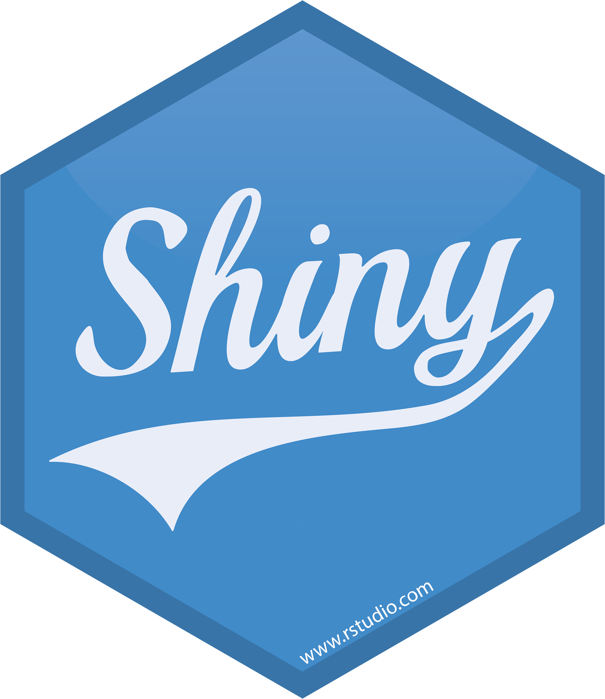

```{css, echo=FALSE}
.pagedjs_page:not(:first-of-type) {
  --sidebar-width: 0rem;
  --sidebar-background-color: #ffffff;
  --main-width: calc(var(--content-width) - var(--sidebar-width));
  --decorator-horizontal-margin: 0.2in;
}
```

```{r setup, include=FALSE}
knitr::opts_chunk$set(echo = FALSE)
library(magrittr)
library(tidyverse)
library(fontawesome)
```


Aside
================================================================================


Contact Information {#contact}
--------------------------------------------------------------------------------

- `r fontawesome::fa("fas fa-at", fill = "#161618")`&nbsp;&nbsp;&nbsp;&nbsp;abhikrroy@protonmail.com
- `r fontawesome::fa("fab fa-github", fill = "#161618")`&nbsp;&nbsp;&nbsp;&nbsp;[github.com/drabhikroy](https://github.com/drabhikroy)
- `r fontawesome::fa("far fa-window-maximize", fill = "#161618")`&nbsp;&nbsp;&nbsp;&nbsp;[abhikroyphd.com](https://abhikroyphd.com)
- `r fontawesome::fa("fas fa-mobile", fill = "#161618", margin_left = "x2.1px")` &nbsp;&nbsp;&nbsp;&nbsp;<a href="tel:+1 812-727-7774">+1 812-727-7774</a>
- `r fontawesome::fa("fab fa-orcid", fill = "#161618")`&nbsp;&nbsp;&nbsp;&nbsp;[0000-0002-7085-8964](https://orcid.org/0000-0002-7085-8964)


Expertise {#skills}
--------------------------------------------------------------------------------

- <b>Program evaluation integrating traditional and machine learning methods</b>

- <b>Quantitative, qualitative, and mixed-methods research</b>

- <i style="color:#3365B3; margin-left: -7px; margin-right: -5px;" class="fab fa-r-project fa-lg"></i> <b>programming</b>

- <b>Statistical modeling and inference</b>

- <b>Data visualization</b>

- <b>Survey methodology spanning design, deployment, and analysis</b>

- <b>Interpretive and computational text analysis</b>

- <b>Web application development and reporting using</b>
<div class="holder" style="margin-bottom: -12px;">
  <div class="left">
     
  </div>
  <div class="middle">
    
  </div>
  <div class="right">
    
  </div>
</div>

- <b>Social network analysis</b>

- <b>Technical writing and markup using</b> $\LaTeX$

<br>
<br>
<br>
<br>
<br>
<br>
<br>
<br>
<div class="holder">
<div class="left">
</div>
<div class="middle">
<a href='https://abhikroyphd.com' target='_blank'></a>
</div>
<div class="right">
</div>
</div>

Main
================================================================================

Dr. Abhik Roy {#title}
--------------------------------------------------------------------------------


<i class="fa-solid fa-graduation-cap" data-fa-mask="fa-solid fa-comment" style="background:white"></i> Education {data-icon=NULL}
--------------------------------------------------------------------------------

### Western Michigan University

Ph.D. in Program Evaluation

&nbsp;&nbsp;Kalamazoo, MI

N/A

*Dissertation*. Building an Evaluation Model of Academic Advising’s Impact on Progression, Persistence, and Retention Within University Settings

### Michigan Technological University

M.S. in Mathematics

&nbsp;&nbsp;Houghton, MI

N/A

*Thesis*. Quotient Rings of the Eisenstein Integers

### West Virginia Wesleyan College

B.S. in Mathematics

&nbsp;&nbsp;Buckhannon, WV

N/A

*Report*. 4-Cell Embedding on a $n$-genus Torus

<i class="fa-solid fa-pen-to-square" data-fa-mask="fa-solid fa-comment" style="background:white"></i>  Professional Experience {data-icon=NULL}
--------------------------------------------------------------------------------

### Independent Evaluation Consultant

N/A

&nbsp;&nbsp;Bloomington, IN

Present - 2025

::: concise
- Create static (fixed), active (automated or animated), and interactive (user-driven) data visualizations in R and Shiny to communicate findings across multiple audiences.
- Develop and validate survey instruments, implement mixed-methods studies, and author federal reporting documents.
- Lead evaluation studies, conduct data analysis, and report findings for federally funded programs in health and education.
- Partner with program staff and academic researchers to design and carry out evaluations that inform practice and policy.
- Prepare journal manuscripts based on evaluation findings for submission to peer-reviewed publications.
- Support HRSA’s Healthy Start Initiative and an NSF-funded teacher preparation program in computational thinking.
:::

### Associate Research Scientist

Indiana University

&nbsp;&nbsp;Bloomington, IN

2025 - 2024

::: concise
- Collaborated with external partners in participatory sessions, translating evidence into program guidance and policy draft language.
- Monitored budgets, schedules, and task lists to keep projects within scope and on time.
- Prepared grant proposals outlining objectives, study designs, budgets, and timelines for external‑funding submissions.
- Presented methods, results, and practical implications to stakeholders through slide decks, briefs, and small‑group discussions.
- Produced color‑safe charts, dashboards, and infographics that remained readable for viewers with diverse visual abilities.
- Used statistical, machine learning, and qualitative approaches to analyze raw data and generate meaningful evaluation findings.
:::

### Assistant Professor

West Virginia University

&nbsp;&nbsp;Morgantown, WV

2023 - 2016

::: concise
- Authored ten peer‑reviewed articles and spoke at more than twenty national conferences.
- Contributed to a dozen program evaluations, leading several and supporting analysis on others; most were funded by federal grants in education or health.
- Taught courses in evaluation, research methods, measurement, and survey design to several hundred students, with an emphasis on applied data science.
- Supported three master’s candidates and one doctoral student from proposal to defense, providing ongoing support with research design, coding, and writing.
- Served on committees at the graduate (master’s and doctoral), program, and college levels.; introduced new courses in data visualization and social network analysis.
:::

### Data Analyst

University of Kansas

&nbsp;&nbsp;Lawrence, KS

2016 - 2014

::: concise
- Merged surveys, interviews, and registrar data to study how advising affected persistence, retention, and graduation.
- Ran needs assessments and participatory evaluations for advising, student‑life, and support units.
- Distributed questionnaires to 300 students and staff; response rates fell between 47% and 91%, depending on the project.
- Built predictive and survival models that flagged at‑risk students, supporting tactics that raised retention by as much as five percentage points.
- Synthesized findings from Delphi panels, interviews, survey metrics, and time-to-event analysis into a unified framework for evaluating advising quality.
- Automated data pulls from the Oracle warehouse and refreshed Tableau dashboards with new R scripts.
:::

<i class="fa-solid fa-file-text-o" data-fa-mask="fa-solid fa-comment" style="background:white"></i> Publications {data-icon=NULL}
--------------------------------------------------------------------------------

### Dey, K., Rahman, M. T., **Roy, A.**, Pyrialakou, V. D., Martinelli, D., Fraustino, J. D., Deskins, J., Rambo-Hernandez, K. E., \& Plein, L. C. (2024). Experiences and perceptions of engineering students towards a cross-disciplinary course using sentiment analysis. *Journal of Civil Engineering Education, 150*(3). [https://doi.org/10.1061/jceecd.eieng-1976](https://doi.org/10.1061/jceecd.eieng-1976)

N/A

N/A

2024

### Kale, U., Kooken, A., Yuan, J., & **Roy, A.** (2023). Teaching science via computational thinking? Enabling future science teachers’ access to computational thinking. *Contemporary Issues in Technology and Teacher Education, 23*(3). https://citejournal.org/volume-23/issue-3-23/science/teaching-science-via-computational-thinking-enabling-future-science-teachers-access-to-computational-thinking

N/A

N/A

2023

### Curtis, R., **Roy, A.**, Lewis, N., Dooty, E. N., & Mikalik, T. (2023). Program evaluation standards for utility facilitate stakeholder internalization of evaluative thinking in the West Virginia Clinical Translational Science Institute. *Journal of MultiDisciplinary Evaluation, 19*(43), 49–65. https://doi.org/10.56645/jmde.v19i43.831

N/A

N/A

N/A

### Kale, U., Yuan, J., & **Roy, A.** (2022). Thinking processes in Code.org: A relational analysis approach to computational thinking. *Computer Science Education, 33*(4), 545–566. https://doi.org/10.1080/08993408.2022.2145549

N/A

N/A

2022

### **Roy, A.**, & Rambo-Hernandez, K. E. (2021). There’s so much to do and not enough time to do it! A case for sentiment analysis to derive meaning from open text using student reflections of engineering activities. *American Journal of Evaluation, 42*(4), 559–576. https://doi.org/10.1177/1098214020962576

N/A

N/A

2021

### Kale, U., **Roy, A.**, & Yuan, J. (2020). To design or to integrate? Instructional design versus technology integration in developing learning interventions. *Educational Technology Research and Development, 68*(2473–2504). https://doi.org/10.1007/s11423-020-09771-8

N/A

N/A

2020

### Rambo-Hernandez, K. E., **Roy, A.**, Morris, M. L., Hensel, R. A. M., Schwartz, J. C., Atadero, R. A., & Paguyo, C. (2018, April). Using interactive theater to promote inclusive behaviors in teams for first-year engineering students: A sustainable approach. Paper presented at the 2018 CoNECD - The Collaborative Network for Engineering and Computing Diversity Conference, Crystal City, Virginia. https://doi.org/10.18260/1-2–29592

N/A

N/A

2018


### Richards-Babb, M., Curtis, R., Ratcliff, B., **Roy, A.**, & Mikalik, T. (2018). General chemistry student attitudes and success with use of online homework: Traditional-responsive versus adaptive-responsive. *Journal of Chemical Education, 95*(5), 691–699. https://doi.org/10.1021/acs.jchemed.7b00829

N/A

N/A

N/A


### Miller, T. A., Carver, J. S., & **Roy, A.** (2018). To go virtual or not to go virtual, that is the question: A comparative study of face-to-face versus virtual laboratories in a physical science course. *Journal of College Science Teaching, 48*(2), 59–67. https://www.jstor.org/stable/26616271

N/A

N/A

N/A


### Davis, J. D., Smith, D. O., **Roy, A. R.**, & Bilgic, Y. K. (2014). Reasoning-and-proving in algebra: The case of two reform-oriented U.S. textbooks. <i>International Journal of Educational Research, 64</i>, 92–106. doi:10.1016/j.ijer.2013.06.012

N/A

N/A

2014

### **Roy, A. R.**, Hobson, K. A., & Coryn, C. L. S. (2012). What’s in a Scriven number? *Journal of MultiDisciplinary Evaluation, 8*(19), 41–45. https://doi.org/10.56645/jmde.v8i19.372

N/A

N/A

2012

<i class="fa-solid fa-book" data-fa-mask="fa-solid fa-comment" style="background:white"></i> Book Chapters {data-icon=NULL}
--------------------------------------------------------------------------------

### **Roy, A. R.** (2017). Social network analysis: Finding meaning in connections. In T. C. Ahern (Ed.), *Social media*. Hauppauge, NY: Nova Science.

N/A

N/A

2017


<i class="fa-solid fa-file-text-o" data-fa-mask="fa-solid fa-comment" style="background:white"></i>  Grants {data-icon=NULL}
--------------------------------------------------------------------------------

### Mining for Meaning: Uniting Machine Learning and Qualitative Research to Simulate Raters in Text Analysis

*National Science Foundation:* [NSF 19-575: Methodology, Measurement, and Statistics (MMS)](https://new.nsf.gov/funding/opportunities/mms-methodology-measurement-statistics/nsf19-575/solicitation) - *Pending*

*Bloomington, IN*

2024

<b>Roy, A.R.</b> - Principal investigator

<i class="fa-solid fa-pencil-alt" data-fa-mask="fa-solid fa-comment" style="background:white"></i>  Invited Contributions {data-icon=NULL}
--------------------------------------------------------------------------------

### What is a Scriven number?

*The American Evaluation Association Newsletter*

N/A

2012

<b>Roy, A.R.</b>, Hobson, K.A., & Coryn, C.L.S.

<i class="fa-solid fa-shapes" data-fa-mask="fa-solid fa-comment" style="background:white"></i>  Evaluations {data-icon=NULL}
--------------------------------------------------------------------------------

<i class="fa-solid fa-toggle-on" data-fa-mask="fa-solid fa-comment" style="background:white"></i> <span class="indented-title" style="font-size: 0.90rem;">Active</span> {data-icon=NULL}
--------------------------------------------------------------------------------

### <span class="indented-title"><i>Lead Program Evaluator & Methodologist</i> - Healthy Start Initiative ([*HRSA-19-049*](https://grants.hrsa.gov/2010/Web2External/Interface/Common/EHBDisplayAttachment.aspx?dm_rtc=16&dm_attid=d3c378a4-b07d-48e5-ab36-38f05a7eeb48) Total Award: *$5,470,000*)</span>

<span class="indented-title">West Virginia University Research Corporation</span>

&nbsp;&nbsp;Morgantown, WV

Current - 2023

<div class="indented-section">

::: concise
- Created and validated survey instruments to assess participant experiences, collecting data from more than 50 individuals.
- Conducted evaluation studies of program activities and authored the evaluation section of the HRSA annual report, as well as a related federal funding renewal proposal.
- Designed and led program-level evaluations, including process, monitoring, and impact studies.
- Developed and implemented a mixed-methods study to analyze longitudinal and cross-sectional data, focusing on smoking cessation among mothers and the experiences of new or distant caregivers and fathers.
:::

</div>

### <span class="indented-title"><i>Program Evaluator & Mixed Methods Analyst</i> - Teaching Science with Computational Thinking: Preparing Preservice Elementary Educators of the Future STEM Workforce ([*2019-NSF 2142274*](https://www.nsf.gov/awardsearch/showAward?AWD_ID=2142274&HistoricalAwards=false) Total Award: *$294,958.00*)</span>

<span class="indented-title">West Virginia University</span>

&nbsp;&nbsp;Morgantown, WV

Current - 2022

<div class="indented-section">

::: concise
- Administered process evaluations for all program activities.
- Created and implemented a longitudinal mixed-method study to analyze more than 50 open-ended survey responses and six interview transcripts, using methods such as HDBSCAN/t-SNE, k-Means, and PCA alongside thematic and content analyses.
- Developed and validated survey instruments to track progress and evaluate the impact of program activities.
- Prepared detailed internal evaluation reports and developed summary documents for federal reporting.
:::

</div>

<i class="fa-solid fa-toggle-off" data-fa-mask="fa-solid fa-comment" style="background:white"></i> <span class="indented-title" style="font-size: 0.90rem;">Completed</span> {data-icon=NULL}
--------------------------------------------------------------------------------

### <span class="indented-title"><i>Community Program Evaluator & Data Scientist</i> - WVCTSI: West Virginia Clinical and Translational Science Institute ([*2017-NIH 2U54GM104942-02*](https://reporter.nih.gov/project-details/9362155) Total Award: *$20,000,000*)</span>

<span class="indented-title">West Virginia University</span>

&nbsp;&nbsp;Morgantown, WV

2022 - 2017

<div class="indented-section">

::: concise
- Advised multiple aspiring graduate students in social data science as they developed and completed independent research projects.
- Analyzed datasets using using multiple guiding the direction and activities of eight distinct programs.
- Authored quarterly reports as well as internal and external annual evaluation documents, disseminated both in print and through interactive formats developed in Rmarkdown.
- Created data visualizations and developed Shiny applications to support internal and public data exploration, including social network analysis for research collaborations, integration of NCBI API data with WVCTSI grant records, and dissemination of findings and practice changes within and beyond West Virginia.
- Designed and disseminated tailored Qualtrics surveys reaching over 5,000 individuals, with user experience and visual design enhanced through HTML, CSS, and JavaScript.
- Led local and multi-site evaluation studies that informed policies across five core medical research and health outreach efforts.
:::

</div>

### <span class="indented-title"><i>Program Evaluator</i> - Appalachian Gerontology Experiences - Advancing Diversity in Aging Research ([*2020-NIH 1R25AG059558-01A1*](https://reporter.nih.gov/search/gvYOStaGnUiejizdD2R25w/project-details/9793672) Total Award: *$678,000*)</span>

<span class="indented-title">West Virginia University</span>

&nbsp;&nbsp;Morgantown, WV

2020 - 2021

<div class="indented-section">

::: concise
- Developed and distributed two customized interactive surveys using Qualtrics, with user experience and visual design enhanced through HTML, CSS, and JavaScript, to collect responses on programmatic activities from a targeted group of 24 students.
- Led three distinct evaluative studies focusing on student efficacy, engagement, and motivation
- Produced an external evaluation summary for federal reporting.
:::

</div>

### <span class="indented-title"><i>Research Methods Advisor & Specialist</i> - Research Initiative: A Holistic Cross-Disciplinary Project Experience as a Platform to Advance the Professional Formation of Engineers ([*2019-NSF 1927232*](https://www.nsf.gov/awardsearch/showAward?AWD_ID=1927232&HistoricalAwards=false) Total Award: *$200,000*)</span>

<span class="indented-title">West Virginia University</span>

&nbsp;&nbsp;Morgantown, WV

<span class="indented-title">2020 - 2022</span>

<div class="indented-section">

::: concise
- Conducted longitudinal studies on the experiences of 30 undergraduate students in specialized interdisciplinary courses that integrated social science and engineering, using both surveys and focus group discussions.
- Mentored engineering faculty members and graduate students in the implementation of research methodologies.
:::

</div>

### <span class="indented-title"><i>Program Evaluator</i> - Stepping UP with Avenue: Progress Monitoring: A Software Suite Helping Teachers Improve Literacy Progress For Deaf/Hard Of Hearing Students (*2017-ED H327S170012* Total Award: *$2,470,440*)</span>

<span class="indented-title">Pennsylvania State University</span>

&nbsp;&nbsp;State College, PA

2018 - 2017

<div class="indented-section">

::: concise
- Evaluated digital tools developed for assessing and engaging individuals who are deaf or hard of hearing.
- Led a multi-site evaluation that examined program delivery, participant engagement, and outcomes.
- Produced a detailed external evaluation brief for federal reporting.
:::

</div>

### <span class="indented-title"><i>Lead Program Evaluator</i> - Cultivating Inclusive Identities of Engineers and Computer Scientists: Expanding Efforts to Infuse Inclusive Excellence in Undergraduate Curricula ([*2017-NSF 1725880*](https://www.nsf.gov/awardsearch/showAward?AWD_ID=1725880) Total Award: *$2,000,000*)</span>

<span class="indented-title">West Virginia University</span>

&nbsp;&nbsp;Morgantown, WV

2018 - 2017

<div class="indented-section">

::: concise
- Applied longitudinal NLP text mining techniques such as concordance, LDA topic modeling, and sentiment analysis to analyze and summarize feedback from over 3,000 first-year engineering students concerning grant-related class activities.
- Carried out longitudinal surveys with over 50 faculty participants to understand expectations, gather input for improvement, and track changes in DEI attitudes and perceptions.
- Created a wide range of static and interactive data visualizations for stakeholder exploration, internal and external reporting, and use in presentations and publications.
- Contributed to multiple journal articles and academic conference presentations.
- Performed personnel evaluations of principal investigators to support broader program assessment efforts.
- Prepared internal evaluation reports and authored the evaluation section of the annual report submitted to the NSF.
:::

</div>

### <span class="indented-title"><i>Program Evaluator</i> - GAUSSI: Generating, Analyzing, and Understanding Sensory and Sequencing Information: A Trans-Disciplinary Graduate Training Program in Biosensing and Computational Biology ([*2017-NSF 1450032*](https://www.nsf.gov/awardsearch/showAward?AWD_ID=1450032&HistoricalAwards=false) Total Award: *$3,013,779*)</span>

<span class="indented-title">Colorado State University</span>

&nbsp;&nbsp;Fort Collins, CO

2020 - 2017

<div class="indented-section">

::: concise
- Carried out 32 interviews and focus groups, both cross-sectional and longitudinal, using unstructured and semi-structured formats to explore the experiences of students and faculty.
- Conducted process evaluations for multiple grant-funded programs, resulting in improved member tracking, greater program efficiency, and increased participant satisfaction.
- Created and validated instruments to assess students’ ability to communicate research findings to a general audience.
- Designed semi-annual adaptive and interactive Qualtrics surveys enhanced with HTML/CSS/JavaScript, securing feedback from over 100 students and faculty with a 95% response rate.
- Generated data visualizations for assessment and longitudinal studies, bolstering inferential statistical analyses to identify trends and support programmatic enhancements, retention strategies, and satisfaction initiatives.
- Produced internal evaluation reports and prepared summaries for use in external communications and federal reporting.
:::

</div>
  
<i class="fa-solid fa-chalkboard-user" data-fa-mask="fa-solid fa-comment" style="background:white"></i> Presentations {data-icon=NULL}
--------------------------------------------------------------------------------

### Let’s get sentimental: Machine learning aided data analysis for large qualitative data sets

*American Evaluation Association Annual Conference*

&nbsp;&nbsp;New Orleans, LA

2022

Seidel, T., Ferguson, C.F., & <b>Roy, A.R.</b>


### Best of both worlds: Affordances of mixing machine learning and qualitative content analysis

*American Educational Research Association Annual Meeting*

&nbsp;&nbsp;San Diego, CA

2022

<b>Roy, A.R.</b>, Ferguson, C.F., Curtis, R., & Babb-Richards, M.

### These aren’t random words just strung together?: Using machine learning and pretty visualizations to discover topics in articles.

*American Evaluation Association Annual Conference*

&nbsp;&nbsp;*virtual*

2020

<b>Roy, A.R.</b>


### Little fish in a big pond, only fish in a little pond: How roles shape our identities as evaluators.

*American Evaluation Association Annual Conference*

&nbsp;&nbsp;Minneapolis, MN

2019

Loomis, D.L., Mikalik, T.L., Curtis, R., <b>Roy, A.R.</b>, & Bernstein, M.


### Evolving program logic models to meet shifting program needs: The case of WV Clinical Translational Science Institute.

*American Evaluation Association Annual Conference*

&nbsp;&nbsp;Minneapolis, MN

2019

Curtis, R., <b>Roy, A.R.</b>, Bernstein, M, Loomis, D.L., & Mikalik, T.L.


### The value of external evaluators when building clinical translational research infrastructure.

*American Evaluation Association Annual Conference*

&nbsp;&nbsp;Minneapolis, MN

2019

Curtis, R., <b>Roy, A.R.</b>, Bernstein, M, Loomis, D.L., & Mikalik, T.L.


### Using associated networks to evaluate content within courses.

*American Evaluation Association Annual Conference*

&nbsp;&nbsp;Minneapolis, MN

2019

<b>Roy, A.R.</b>, Kale, U, & Yuan, J.


### Why is it that writers write but fingers don’t fing? Using machine learning and lexemes to make sense of nonsense.

*American Evaluation Association Annual Conference*

&nbsp;&nbsp;Minneapolis, MN

2019

<b>Roy, A.R.</b>, Curtis, R., Mikalik, T.L., Loomis, D.L., & Bernstein, M.


### Iscovering the underlying meaning behind <i>get me off your f***ing mailing list?</i> and most other narratives.

*American Evaluation Association Annual Conference*

&nbsp;&nbsp;Minneapolis, MN

2019

<b>Roy, A.R.</b>, Curtis, R., Mikalik, T.L., Loomis, D.L., & Bernstein, M.


### Assessing for improvement: The use of artificial intelligence to uncover potential differential impact of assignments.

*American Evaluation Association Annual Conference*

&nbsp;&nbsp;Toronto, CN

2019

<b>Roy, A.R.</b> & Rambo-Hernandez, K.


### That's a pretty picture of dots and lines but what does it mean?: A Q&A session with the Social Network Analysis TIG leaders.

*American Evaluation Association Annual Conference*

&nbsp;&nbsp;Cleveland, OH

2018

<b>Roy, A.R.</b>, Durland, M.M., Woodland, R., & Phillips, G.


### Navigating buy-in and shifting evaluation needs over time in NIG Clinical Translational Research Award.

*American Evaluation Association Annual Conference*

&nbsp;&nbsp;Cleveland, OH

2018

Curtis, R., <b>Roy, A.R.</b>, & Mikalik, T.L.


### Using a mixed methods evaluation to discover how an interactive theater based model stimulates inclusive behaviors in engineering.

*American Evaluation Association Annual Conference*

&nbsp;&nbsp;Cleveland, OH

2018

<b>Roy, A.R.</b>, Rambo-Hernandez, K., Hensel, R.A., & Morris, M.L.


### Collaboration evaluation: Using social network analysis to reveal an active undiscovered network.

*American Evaluation Association Annual Conference*

&nbsp;&nbsp;Cleveland, OH

2018

<b>Roy, A.R.</b>, Curtis, R., & Mikalik, T.L.


### Examining the past and looking forward: The future of evaluation theory and use.

*American Evaluation Association Annual Conference*

&nbsp;&nbsp;Cleveland, OH

2018

<b>Roy, A.R.</b> & Hobson, K.A.


### Transforming graduate STEM Education: A theory-driven evaluation of the GAUSSI National Science Foundation Research Training (NRT) Program.

*American Evaluation Association Annual Conference*

&nbsp;&nbsp;Washington, DC

2017

<b>Roy, A.R.</b>, Hernandez, P.A., Chen, T., & Paguyo, C.


### Program evaluation for everyone! - Constructing an online foundational course for capacity building using theorists as a focus.

*American Evaluation Association Annual Conference*

&nbsp;&nbsp;Washington, DC

2017

<b>Roy, A.R.</b> & Curtis, R.P.


### Three stages down! Exploring the criteria for the next generation of evaluation theorists through social network analysis.

*Hawaii-Pacific Evaluation Association Annual Conference*

&nbsp;&nbsp;Kane’ohe, HI

2017

<b>Roy, A.R.</b> & Hobson, K.A.


### Content in the background: Using evaluation theorists as the principal motivator for foundational evaluation courses.

*Hawaii-Pacific Evaluation Association Annual Conference*

&nbsp;&nbsp;Kane’ohe, HI

2017

<b>Roy, A.R.</b> & Curtis, R.P.


### Survey says! Students getting tired of surveys.

*National Academic Advising Association Annual Conference*

&nbsp;&nbsp;Las Vegas, NV

2015

<b>Roy, A.R.</b> & Goetz, H.L.


### Influences of Hierarchical Linear Modeling in evaluation.

*Aotearoa New Zealand Evaluation Association Annual Conference*

&nbsp;&nbsp;Auckland, NZ

2013

Hobson, K.A., <b>Roy, A.R.</b> & Coryn, C.L.S.


### Survey sample methods: Evaluators’ toolbox refreshment.

*American Evaluation Association Annual Conference*

&nbsp;&nbsp;Minneapolis, MN

2012

Hobson, K.A., <b>Roy, A.R.</b> & Coryn, C.L.S.

<i class="fa-solid fa-university" data-fa-mask="fa-solid fa-comment" style="background:white"></i> Teaching Experience {data-icon=NULL}
--------------------------------------------------------------------------------

<i class="fa-solid fa-clipboard-check" data-fa-mask="fa-solid fa-comment" style="background:white"></i> <span class="indented-title" style="font-size: 0.90rem;">Evaluation, Measurement, and Research Methods (2016 - 2023)</span> {data-icon=NULL}
--------------------------------------------------------------------------------

### <span class="indented-title"><i>[Data Visualization](https://edp693e.abhikroyphd.com/)</i></span>

<span class="indented-title">West Virginia University</span>

&nbsp;&nbsp;Morgantown, WV

2020 - 2018

<span class="indented-title">2020, 2018</span>


### <span class="indented-title"><i>Educational Psychology</i></span>

<span class="indented-title">West Virginia University</span>

&nbsp;&nbsp;Morgantown, WV

2017


### <span class="indented-title"><i>Educational Research</i></span>

<span class="indented-title">West Virginia University</span>

&nbsp;&nbsp;Morgantown, WV

2016


### <span class="indented-title"><i>[Introduction to Research](https://edp612.abhikroyphd.com/)</i></span>

<span class="indented-title">West Virginia University</span>

&nbsp;&nbsp;Morgantown, WV

2022 - 2016

<span class="indented-title">2022, 2018, 2017, 2016</span>


### <span class="indented-title"><i>[Measurement/Evaluation in Educational Psychology](https://edp611.abhikroyphd.com/)</i></span>

<span class="indented-title">West Virginia University</span>

&nbsp;&nbsp;Morgantown, WV

2020 - 2018

<span class="indented-title">2022, 2020, 2018</span>


### <span class="indented-title"><i>[Mixing Research Methodologies](https://edp618.abhikroyphd.com/)</i></span>

<span class="indented-title">West Virginia University</span>

&nbsp;&nbsp;Morgantown, WV

2019 - 2017

<span class="indented-title">2022, 2019, 2018, 2017</span>


### <span class="indented-title"><i>[Program Evaluation](https://edp617.abhikroyphd.com/)</i></span>

<span class="indented-title">West Virginia University</span>

&nbsp;&nbsp;Morgantown, WV

2023 - 2017

<span class="indented-title">2023, 2022, 2021, 2020, 2019, 2018, 2017</span>


### <span class="indented-title"><i>[Social Network Analysis](https://edp693g.abhikroyphd.com/)</i></span>

<span class="indented-title">West Virginia University</span>

&nbsp;&nbsp;Morgantown, WV

2021 - 2017

<span class="indented-title">2021, 2017</span>


### <span class="indented-title"><i>[Statistical Methods 1](https://edp613.abhikroyphd.com/)</i></span>

<span class="indented-title">West Virginia University</span>

&nbsp;&nbsp;Morgantown, WV

2021 - 2017

<span class="indented-title">2021, 2020, 2019, 2018, 2017</span>


### <span class="indented-title"><i>[Survey Research](https://edp619.abhikroyphd.com/)</i></span>

<span class="indented-title">West Virginia University</span>

&nbsp;&nbsp;Morgantown, WV

2022 - 2020

<span class="indented-title">2022, 2020</span>

<i class="fa-solid fa-infinity fa-fw" data-fa-mask="fa-solid fa-comment" style="background:white"></i> <span class="indented-title" style="font-size: 0.90rem;">Mathematics (2005 - 2015)</span> {data-icon=NULL}
--------------------------------------------------------------------------------

### <span class="indented-title"><i>Business Calculus</i></span>

<span class="indented-title">Central Michigan University</span>

&nbsp;&nbsp;Mount Pleasant, MI

2008


### <span class="indented-title"><i>College Algebra</i></span>

<span class="indented-title">Central Michigan University</span>

&nbsp;&nbsp;Mount Pleasant, MI

2009


### <span class="indented-title"><i>Discrete Mathematics</i></span>

<span class="indented-title">Central Michigan University</span>

&nbsp;&nbsp;Pittsburgh, KS

2012


### <span class="indented-title"><i>Elementary Statistics</i></span>

<span class="indented-title">Central Michigan University</span>

&nbsp;&nbsp;Pittsburgh, KS

2014


### <span class="indented-title"><i>Foundations of Statistics</i></span>

<span class="indented-title">Central Michigan University</span>

&nbsp;&nbsp;Pittsburgh, KS

2010 - 2009

<span class="indented-title">2009, 2010</span>


### <span class="indented-title"><i>Intermediate Algebra</i></span>

<span class="indented-title">Central Michigan University</span>

&nbsp;&nbsp;Mount Pleasant, MI

2008 - 2007

<span class="indented-title">2007, 2008</span>


### <span class="indented-title"><i>Integral Calculus</i></span>

<span class="indented-title">Michigan Technological University</span>

&nbsp;&nbsp;Houghton, MI

2007


### <span class="indented-title"><i>Linear Algebra</i></span>

<span class="indented-title">University of Kansas</span>

&nbsp;&nbsp;Lawrence, KS

2015 - 2014

<span class="indented-title">2014, 2015</span>


### <span class="indented-title"><i>Mathematical Thinking Grades 6-12</i></span>

<span class="indented-title">Western Michigan University</span>

&nbsp;&nbsp;Kalamazoo, MI

2013


### <span class="indented-title"><i>Mathematics Curriculum Grades 6-12</i></span>

<span class="indented-title">Western Michigan University</span>

&nbsp;&nbsp;Kalamazoo, MI

2014 - 2013

<span class="indented-title">2013, 2014</span>


### <span class="indented-title"><i>Multivariable Calculus</i></span>

<span class="indented-title">Michigan Technological University</span>

&nbsp;&nbsp;Houghton, MI

2005


### <span class="indented-title"><i>Single Variable Calculus</i></span>

<span class="indented-title">Michigan Technological University</span>

&nbsp;&nbsp;Houghton, MI

2007 - 2006

<span class="indented-title">2006, 2007</span>


<i class="fa-solid fa-paragraph" data-fa-mask="fa-solid fa-comment" style="background:white"></i> Service {data-icon=NULL}
--------------------------------------------------------------------------------

### Associate Editor

[*Journal of MultiDisciplinary Evaluation*](https://journals.sfu.ca/jmde/index.php/jmde_1/about/editorialTeam)

N/A

2022 - 2013

<i class="fa-solid fa-users" data-fa-mask="fa-solid fa-comment" style="background:white"></i> Memberships {data-icon=NULL}
--------------------------------------------------------------------------------

### American Evaluation Association

N/A

N/A

2022 - 2012


Disclaimer {#disclaimer style="width: calc(var(--content-width) - var(--sidebar-width)); padding-left: var(--sidebar-horizontal-padding);"}
--------------------------------------------------------------------------------

<sup><a href="#custom-footnote"><a></sup>

<div id="custom-footnote">Made with &nbsp;&nbsp;&nbsp;<i style="color:#3365B3; margin-top: 3px; margin-left: -7px; margin-right: -5px;" class="fab fa-r-project"></i>&nbsp;&nbsp;&nbsp;: [Source code](https://github.com/drabhikroy/Courses/blob/iam/content/en/work/resume-html.Rmd){target='_blank}. Last updated on `r format(Sys.Date(), format="%B %d, %Y")`</div> 
